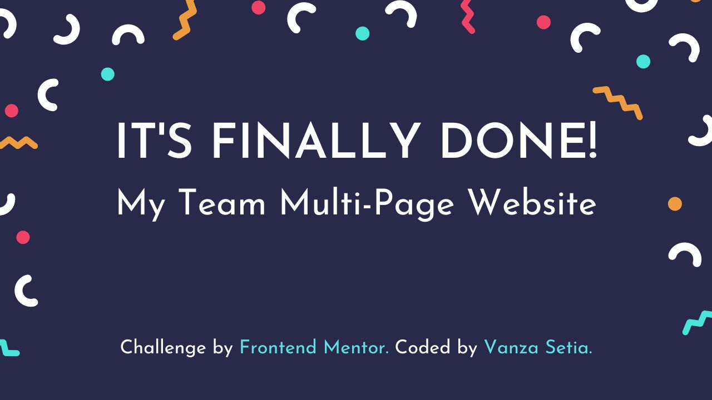
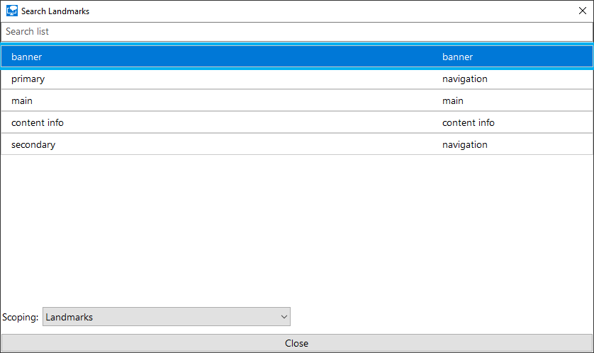

<p align="left">
  <a href="https://www.frontendmentor.io/challenges?difficulties=4"></a>
  
  <a href="https://twitter.com/vanzasetia"></a>
  
  
  
</p>

<p>
  <a href="http://jigsaw.w3.org/css-validator/check/referer">
    
    </a>
    <a href="https://github.com/standard/semistandard">
      
    </a>
</p>

# Myteam Multi-Page Website

## Table of contents
- [Overview](#overview)
  - [Introduction](#introduction)
  - [The challenge](#the-challenge)
  - [Links](#links)
- [My process](#my-process)
  - [Built with](#built-with)
  - [What I learned](#what-i-learned)
  - [Useful resources](#useful-resources)
- [Author](#author)
- [Acknowledgements](#acknowledgements)
- [License](#license)
- [References](#references)

## Overview
[(Back to top)](#table-of-contents)

### Introduction

The purpose of creating this project is to sharpen my coding skill.

In this file I'm going to tell you everything, starting from tools that I used, and much more.

That's it for the introduction and **happy reading!**

### The Challenge

My challenge is to build out this multi-page website and get it looking as close to the design as possible.

The users should be able to:

- View the optimal layout for each page depending on their device's screen size
- See hover states for all interactive elements throughout the site
- See the correct content for each team member on the About page when the + icon is clicked
- Receive an error message when the contact form is submitted if:
  - The *Name*, *Email Address* or *Message* fields are empty should show "This field is required"
  - The *Email Address* is not formatted correctly should show "Please use a valid email address"
- See visible focus states for interactive elements when navigating by keyboard
- Understand and be able to navigate page content while using assistive technology
- Access the website without JavaScript

### Links

- [Live Review](https://myteamsoftware.netlify.app/)
- [Frontend Mentor Solution Page]()

## My Process

[(Back to top)](#table-of-contents)

### Built With

- HTML Semantic Tags
- [BEM (Block, Element, Modifier)](https://sparkbox.com/foundry/bem_by_example)
- [Sass](https://sass-lang.com/)
- JavaScript
- CSS Flexbox
- CSS Grid
- Modern CSS such as: `clamp()`, custom properties (variables), etc.
- Mobile-first workflow
- [No-motion first approach](https://tatianamac.com/posts/prefers-reduced-motion)
- [instant.page](https://instant.page/) - preload pages with `<link rel="prefetch" href="url">` only when the users interact with the link.

### What I Learned

#### Accessible Menu Component

This was the first time that I created a hamburger menu. So, I looked up [Inclusive Components](https://inclusive-components.design/) to help me create accessible menu component.

Here is the HTML markup.

```html
<nav aria-labelledby="primary-navigation">
  <p id="primary-navigation" hidden>primary</p>
  <button
    type="button"
    aria-expanded="false"
    aria-controls="menu-list"
    aria-labelledby="menu-button-label"
  >
    <span id="menu-button-label" hidden>menu</span>
    
  </button>
  <ul
    id="menu-list"
    role="menu"
  >
    <li role="presentation">
      <a href="/" role="menuitem">home</a>
    </li>
    <li role="presentation">
      <a href="/about.html" role="menuitem">about</a>
    </li>
    <li role="presentation">
      <a href="/contact.html" role="menuitem">contact us</a>
    </li>
  </ul>
  <button
    type="button"
    aria-expanded="true"
    aria-controls="menu-list"
    aria-labelledby="close-menu-button-label"
  >
    <span id="close-menu-button-label" hidden>close menu</span>
    
  </button>
</nav>
```

Let's discuss the HTML chunk by chunk.

The first chunk is this.

```html
<nav aria-labelledby="primary-navigation">
  <p id="primary-navigation" hidden>primary</p>
</nav>
```

I label the `nav` because there are two `nav` elements. I need to label both of them so that screen reader users can differentiate between those `nav`.



This way, the screen reader users can differentiate them.

*Why do I choose this technique to label the `nav`?* It's because the translation API can translate the word *primary* and *secondary*. If I use [`aria-label` then those labels probably won't get translated](https://adrianroselli.com/2019/11/aria-label-does-not-translate.html). But, I am not sure that translation API be able to translate hidden text.

I used `aria-labelledby` because it can get the text content even though the `p` has `hidden` attribute.

> See [aria-labelledby - Accessibility | MDN](https://developer.mozilla.org/en-US/docs/Web/Accessibility/ARIA/Attributes/aria-labelledby)

Next, let me explain the hamburger menu button.

```html
<button
  type="button"
  aria-expanded="false"
  aria-controls="menu-list"
  aria-labelledby="menu-button-label"
>
  <span id="menu-button-label" hidden>menu</span>
  
</button>
```

Some things are going on so I list them.

- `button` - to tell everyone that it is a button or an interactive element. As a side note, don't use non-interactive elements for something that has interactivity.
- `type="button"` - to prevent unexpected behavior. Reference: [Checklist - The A11Y Project #use-the-button-element-for-buttons](https://www.a11yproject.com/checklist/#use-the-button-element-for-buttons)
- `aria-expanded` - to tell the screen readers whether the `button` is in "expanded" state or "collapsed" state. Or in other words, it is used to tell the screen reader whether the menu is opened or closed.
- `aria-controls` - to tell that this button is controlling the menu (`ul`).
- `aria-labelledby` - to give the `button` an accessible name (*menu*). It's the same way as labeling the `nav` elements.

Next, let me explain the list.

```html
<ul
  id="menu-list"
  role="menu"
>
  <li role="presentation">
    <a href="/" role="menuitem">home</a>
  </li>
  <li role="presentation">
    <a href="/about.html" role="menuitem">about</a>
  </li>
  <li role="presentation">
    <a href="/contact.html" role="menuitem">contact us</a>
  </li>
</ul>
```

*"What's the purpose of doing all these things?"* (You may ask)

- `ul[role="menu"]` - to tell screen readers that it is a menu
- `li` with `role="presentation"` - to remove the semantic meaning of the `li`.
- `a` with `role="menuitem"` - to tell that it is an item of a menu. This also removes the semantic meaning of the `a` tag.

Lastly, for the close button.

```html
<button
  type="button"
  aria-expanded="true"
  aria-controls="menu-list"
  aria-labelledby="close-menu-button-label"
>
  <span id="close-menu-button-label" hidden>close menu</span>
  
</button>
```

It's similar to the hamburger menu button.

- `button` - to tell everyone that it is a button or an interactive element.
- `type="button"` - to prevent unexpected behavior.
- `aria-expanded="true"` - the close button is only available when the menu is opened. So, it always has `true` value.
- `aria-controls` - to tell that this button is controlling the menu (`ul`).
- `aria-labelledby` - to give the `button` an accessible name (*close menu*). The text content should be different from the hamburger menu button. This way, the users can differentiate between those two buttons.

Then, for JavaScript, it is used to toggle the state of the `aria-expanded` on the menu button. Also, toggle the visibility of the menu.

#### Problem With Hamburger Menu

Now, there is a problem with this hamburger menu.

When, the users zoom the page, at some zoom level (in my case at 400% zoom level), not all menu items are visible.


I can't scroll to see the rest of the menu items.

It's because of the `position: fixed`. You may hear before that it's best to avoid fixed and absolute positioning. This is one of the reasons.

#### No JavaScript No Problem

Usually, when the users turn off the JavaScript, I decided to give them only a message to turn on JavaScript.


Now, I try a different approach. I try to do the *progressive enhancement*. So, instead of telling the users to turn on JavaScript, I decided to provide a way for users to interact with the site without JavaScript.

##### Menu

It only affects mobile users. So, when JavaScript is on they will get the hamburger menu.


JavaScript off, the users will get this.


By the way, it also fixes the hamburger menu issue that I mentioned. At 400% zoom level the users can access all the links easily.


So, by turning off JavaScript, the site becomes more accessible.

#### Performance

I start knowing about web performance after watching some of the Harry Roberts talks. Here are some of his talks that I love.

- [Harry Roberts - Get Your "head" Straight - Youtube](https://www.youtube.com/watch?v=MHyAOZ45vnU)
- [FaCSSt: CSS & Performance. Harry Roberts. JS Fest 2018 - Youtube](https://www.youtube.com/watch?v=OsYgrfx_MqQ)
- [Harry Roberts - Why Fast Matters - Youtube](https://www.youtube.com/watch?v=gGAOigMbBwo)

But, before you start watching them, I want to tell you how I optimize the performance of my site.

So, it's about Google Fonts. The site is using the "Livvic" font family. The site is required three different font weights, 700, 600, and 500.

The problem is the 500 font-weight is only used on a very little amount of content.

On the home page, it is used only on the highlighted content.


The same goes for the about page.


It is not used on the contact page.

So, I don't want my users to download another `woff2` for almost nothing. I decided to use the Google Fonts CSS API. I used the `text=` URL parameter to input all the necessary text.

> Reference: [CSS API update  |  Google Fonts  |  Google Developers #optimizing_your_font_requests](https://developers.google.com/fonts/docs/css2#optimizing_your_font_requests)

There's no way to automate the process of typing all the text, so I typed all the text. Then, URL-encode those text using ["Url Encoder - Online Tool"](https://www.urlencoder.net/).

Here's the URL.

[https://fonts.googleapis.com/css2?family=Livvic:wght@500&text=Product%20Manager%20at%20Bookmark%20Founder%20of%20Manage%20Co-founder%20of%20MyPhysio%20Founder%20&%20CEO%20Co-founder%20&%20COO%20Co-founder%20&%20CTO%20Business%20Development%20Lead%20Lead%20Marketing%20Head%20of%20Talent&display=swap](https://fonts.googleapis.com/css2?family=Livvic:wght@500&text=Product%20Manager%20at%20Bookmark%20Founder%20of%20Manage%20Co-founder%20of%20MyPhysio%20Founder%20&%20CEO%20Co-founder%20&%20COO%20Co-founder%20&%20CTO%20Business%20Development%20Lead%20Lead%20Marketing%20Head%20of%20Talent&display=swap)

Here's the result.

```css
@font-face {
  font-family: 'Livvic';
  font-style: normal;
  font-weight: 500;
  font-display: swap;
  src: url(https://fonts.gstatic.com/l/font?kit=rnCq-x1S2hzjrlffm8Aet0_ead7nGzxFWtYxzI2kkH8XNeA2bF0mfE_6&skey=1ce7eacc326b4a17&v=v13) format('woff2');
}
```

Then, I decided to download the font file. The file size is only **6.25kb**. If I import it normally the file size can be **39kb**. So, it means that I managed to reduce the file size up to **80%**.

### Useful Resources

- [Menus & Menu Buttons | Inclusive Components](https://inclusive-components.design/menus-menu-buttons/) -  This is an amazing article that helped me create an accessible menu component. I'd recommend it to anyone that doing this challenge (or any other challenges that need a hamburger menu).

## Author

[(Back to top)](#table-of-contents)

- Frontend Mentor - [@vanzasetia](https://frontendmentor.io/profile/vanzasetia)
- Twitter - [@vanzasetia](https://twitter.com/vanzasetia)
- Code Newbie - [@vanzasetia](https://community.codenewbie.org/vanzasetia)
- Want to see me on other platforms? [Check my linktree!](https://linktr.ee/vanzasetia)

## Acknowledgements

[(Back to top)](#table-of-contents)

## License

[(Back to top)](#table-of-contents)

> You can check out [the full license](./LICENSE)

## References

[(Back to top)](#table-of-contents)

> See the [documentation.](./docs/README.md)
